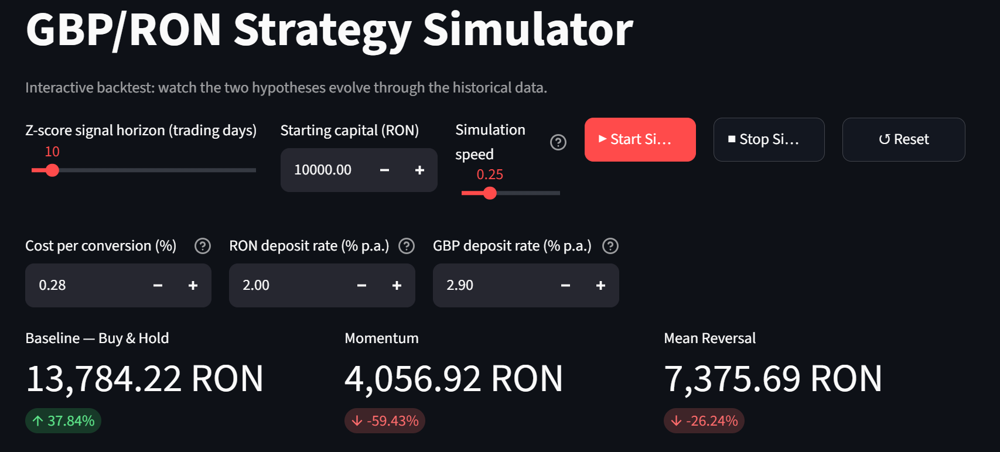
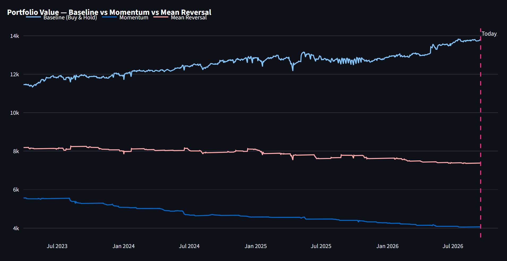

# GBP/RON Momentum vs Mean-Reversion Analysis & Dashboard

Do unusually large short-term moves in GBP/RON tend to **continue** (Momentum) or **reverse** (Mean Reversion)? This project tests my personal hypothesis that Mean Reversion should outperform Momentum on 10+ years of daily data, simulating each as a RON-denominated strategy against a buy-and-hold benchmark. 

The project also includes an interactive Streamlit dashboard that replays the backtest over the 10+ year period, allowing the user to change the simulation's parameters and analyze how results vary.





### *Note*: Please refer to the Results pdf document for a detailed explanation of the project and analysis of the results of the current simulation, and using modified parameters via the dashboard.

## Downloading the Project

**Requirements:** Python 3 and an internet connection (data is downloaded from Yahoo Finance on first run).

```bash
git clone https://github.com/andra-palada/GBP_RON_StrategyAnalysis.git
cd GBP_RON_StrategyAnalysis

python3 -m venv .venv
source .venv/bin/activate          # Windows: .venv\Scripts\activate
pip install -r requirements_dashboard.txt
```

Run the analysis (prints Part 1 and Part 2 results):

```bash
python GBP_RON_Project.py
```

Run the dashboard:

```bash
streamlit run gbp_ron_dashboard.py
```

### Directory structure

```
├── GBP_RON_Project.py           # Signal test + portfolio simulation
├── gbp_ron_dashboard.py         # Streamlit dashboard
├── requirements_dashboard.txt   # Python dependencies
├── README.md
├── dashboard_header.png         # photo for README
└── dashboard_2023-2026.png      # photo for README
```

## Hypotheses

Both strategies use the same signal, a z-score of the recent GBP/RON return standardized against its own recent history, and are tested **separately** (never combined). Each strategy either holds GBP or sits in RON; neither goes short.

| | Idea | Rule |
|---|---|---|
| **H1 – Momentum** | An unusually strong trend in GBP/RON continues | Hold GBP while `z > 1`, otherwise hold RON |
| **H2 – Mean reversion** | An unusually strong trend in GBP/RON reverses | Hold GBP while `z < -1`, otherwise hold RON |

The benchmark is **buy-and-hold**: convert all RON to GBP on day one and never trade.

## Data

- **Source:** Yahoo Finance via [`yfinance`](https://github.com/ranaroussi/yfinance), ticker `GBPRON=X`
- **Frequency:** daily closing prices
- **Sample:** January 2016 to September 2026 (10+ years)
- Yahoo Finance FX quotes are indicative, not executable dealer prices.

## Method

### 1. Signal

```
r_t = Close_t / Close_(t-10) - 1                     # 10-day return
z_t = (r_t - mean(r over 40 days)) / std(r over 40 days)
```

*Note:* The 10- and 40-day windows overlap, breaking the independence of observations, which can affect the statistical conclusions drawn from the project. The motivation behind the *10-day window* for the return lies in attempting to use a significant trend as a signal, one that persists over a longer period of time - not relying on day-to-day volatility. Additonally, although using *daily returns* would mean having independent data points, using them as a signal would also create very frequent trading opportunities, bringing up transaction costs and consequently reducing the strategies' returns. Given more time, I would research a way to use independent windows of time without capturing daily volatility and increasing transaction costs.

### 2. Does the signal have predictive power? (Part 1)

For every day, the forward 10-day return (close *t* to close *t+10*) is averaged within three categories: `z > 1`, `z < -1`, and `-1 <= z <= 1` (default to compare against).

### 3. Portfolio simulation (Part 2)

- Each strategy starts with **10,000 RON**.
- **Timing:** the z-score at the close of day *t-1* sets the position held on day *t*, which earns the return from close *t-1* to close *t*.
- **Daily strategy return** = `(1 + GBP/RON return)*(1 + GBP_Interest) - 1` if position holds GBP (position exposed to FX fluctuations and accumulates interest) ; `(1 + RON_Interest)` if position holds RON (only accumulates interest); exchange fees also applied on days when trade occurs; portfolio value compounds these returns. 
- **Metrics reported:** *final value*, *total return*, annualised *Sharpe* ratio and *Information* ratio (both compared to Buy&Hold benchmark, see the Notes section in the Report for an explanation of the benchmark), number of *days holding GBP*, and number of *entries and exits*.

## Dashboard

An interactive Streamlit app that replays the backtest through history one trading day at a time.

*Note:* Repeated runs of the project may cause Yahoo Finance to
throw an exception when attempting to retrieve the data. In this case,
the DataFrame may be empty and the dashboard will be unable to load.
If this occurs, wait before trying again and clear the cache or restart
Streamlit.

Features:
- Adjustable z-score lookback (5–60 trading days), starting capital and animation speed
- Adjustable Exchange fee, GBP Interest, RON Interest
- Start / Stop / Reset controls
- Live portfolio values and % returns for Buy & Hold, Momentum and Trend Reversal (mean reversion)
- Single Plotly chart with a marker for the simulated "today"

#### AI Usage Note 
During this project, I used LLMs (ChatGPT (GPT-5.6 Luna), Claude (Sonnet 5 Extra), Gemini (3.5 Flash)) for:
- *LEARNING*: 
    - researching the appropriate setup for the simulation (how to source data, difference between a short and flat position,  difference in volatility and bid-ask spreads between RON and GBP)
    - understanding all the factors used to evaluate a strategy aside from the return (Sharpe ratio vs Information ratio, time in market),
    - understanding the limitations brought by some of my assumptions (e.g. constant transaction fee vs bid/ask spread, high number of transactions cutting down returns of strategies)
- *CODING*: 
    - creating the Streamlit dashboard
    - making parts of Python code more efficient and compressed (calculate days elapsed, vectorized calculation of strategy returns)
- *STYLING*: 
    - comment and output formatting 
    - ensuring code is easy to read and consistent across sections
    - formatting README and Latex documents.

See the Report for the challenges that arose while using AI, as well as for an analysis of the project configuration and results.